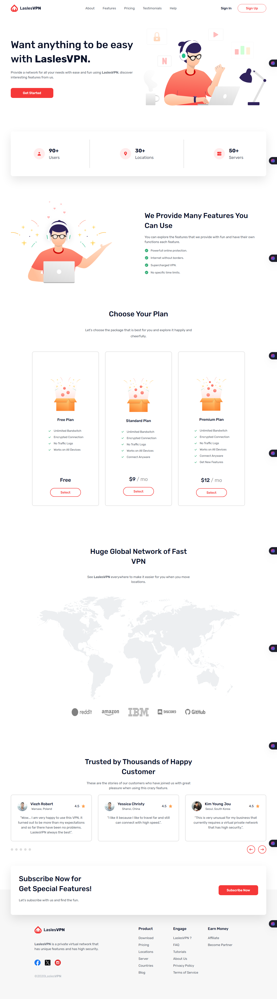

````markdown
# LaslesVPN Landing Page



A responsive landing page for LaslesVPN, showcasing features, pricing, testimonials, and global network coverage. Built with HTML & CSS using a mobile-first approach.

## Features

- **Responsive Design**: Adapts to all screen sizes (desktop, tablet, mobile)
- **Interactive Elements**: Hover effects, smooth scrolling, hamburger menu
- **8 Key Sections**:
  - Header with dynamic navigation
  - Feature highlights & statistics
  - Pricing plans (Free/Standard/Premium)
  - Global network map & partner logos
  - Customer testimonials
  - Subscription CTA
- **Modern Typography**: Rubik font from Google Fonts
- **Optimized Assets**: SVG illustrations and PNG icons

## Technologies


- **HTML5**: Semantic structure
- **CSS3**:
  - Flexbox/Grid layouts
  - CSS Variables
  - Media queries
  - CSS Reset
- **Google Fonts**: Rubik typeface

## Installation

1. Clone repository:

```bash
git clone https://github.com/your-username/lasles-vpn-landing-page.git
```
````

2. Navigate to project:

```bash
cd lasles-vpn-landing-page
```

3. Open in browser:

- Double-click `index.html` or
- Use live server extension

**Credits**:

- [Rubik Font](https://fonts.google.com/specimen/Rubik) by Google Fonts

---

Built with ❤️ by **[Ibrahim Salah]**  
[Contact Email](mailto:ibra20salah@outlook.com)

```

```
